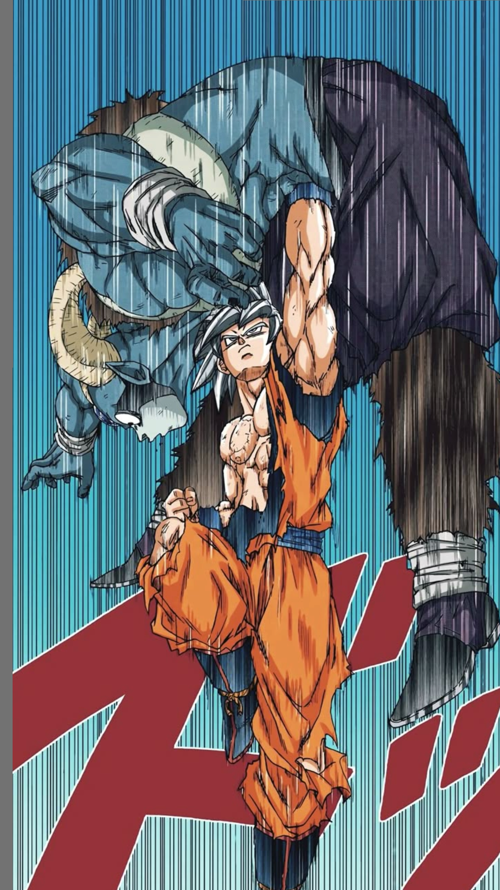

# SaiyanVerse 🐉



Una experiencia web interactiva y premium dedicada a **Dragon Ball Super**. Este proyecto no es solo una página web, es una inmersión completa al universo de Akira Toriyama y Toyotaro, diseñada para fanáticos que buscan una forma moderna y estética de explorar el lore y leer el manga.

## 🚀 Características Principales

- **Diseño Premium (Glassmorphism):** Interfaz moderna y elegante con efectos de cristal, desenfoques dinámicos y fondos oscuros inmersivos que hacen resaltar el arte.
- **Línea de Tiempo de Transformaciones:** Una sección animada e interactiva (impulsada por GSAP ScrollTrigger) que recorre las fases de los guerreros Z, desde el Súper Saiyajin clásico hasta el Ultra Instinto y Gohan Bestia, con paneles que flotan y reaccionan al movimiento del cursor (efecto Parallax).
- **Perfiles de Personajes:** Estadísticas detalladas y descripciones canónicas de los guerreros más poderosos de la Tierra.
- **Reproductor de Música Integrado:** Ambientación sonora garantizada con un reproductor persistente que te acompaña durante toda tu navegación sin interrumpirse al cambiar de sección.
- **Lector de Manga Nativo (Próximamente):** Una biblioteca integrada para disfrutar los volúmenes del manga con un lector estilo Webtoon/MangaPlus.
- **100% Responsivo:** Diseño meticulosamente adaptado para dispositivos móviles, asegurando una experiencia fluida sin superposición de elementos.

## 🛠️ Tecnologías Utilizadas

Este proyecto fue desarrollado utilizando tecnologías web nativas, priorizando el rendimiento y la personalización absoluta:

- **HTML5 & CSS3:** Maquetación semántica y estilos nativos sin frameworks pesados, utilizando variables CSS y media queries avanzadas.
- **Vanilla JavaScript:** Lógica de interfaz, manejo de estado del reproductor de audio (LocalStorage) y efectos dinámicos.
- **GSAP (GreenSock Animation Platform):** 
  - `gsap.min.js`: Animaciones fluidas de entrada y salida.
  - `ScrollTrigger.min.js`: Control preciso de animaciones vinculadas al nivel de scroll del usuario (fijación de secciones, interpolación de clases).

## 📂 Estructura del Proyecto

```text
📁 SaiyanVerse/
├── 📄 index.html        # Landing page principal (Hero, Historia, Fases, Perfiles)
├── 📄 biblioteca.html   # Grilla de selección de volúmenes del manga
├── 📄 capitulo1.html    # Interfaz del lector de manga interactivo
├── 📄 styles.css        # Sistema de diseño, tokens y media queries
├── 📄 main.js           # Lógica de GSAP, Parallax y Blur dinámico
├── 📄 audioPlayer.js    # Lógica del reproductor de música persistente
└── 📁 IMG/              # Assets visuales, recursos manga y renders pop-out
```

## 🌐 Despliegue (Deployment)

Este proyecto está compuesto **100% por archivos estáticos** (HTML, CSS, JS e imágenes). No requiere de ningún backend ni servidor Node.js para funcionar. 

Esto significa que puedes desplegarlo de forma **totalmente gratuita y directa** utilizando cualquiera de estas plataformas:

1. **GitHub Pages (Recomendado):** Simplemente sube este repositorio a GitHub y activa GitHub Pages desde la pestaña *Settings*. ¡En menos de 1 minuto estará en vivo!
2. **Vercel / Netlify / Cloudflare Pages:** Solo tienes que arrastrar la carpeta o conectar tu repositorio y la plataforma hará el resto automáticamente.

---
*Desarrollado con pasión por [Rodrigo Antunez](https://rodria45.github.io/rodrigo-antunez-portfolio/).*
